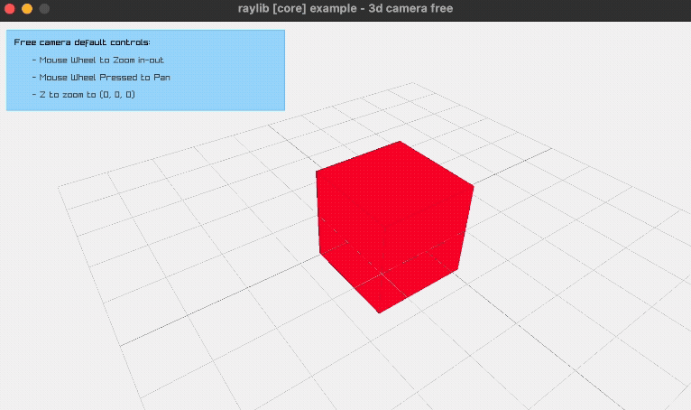

# Raylib C++ Example Project

This is a simple C++ project using **Raylib** for graphics. It uses the basic <a href="https://www.raylib.com/examples/core/loader.html?name=core_3d_camera_free" target="_blank">example of a 3D free camera</a> . The project uses a **statically linked Raylib library**, making it portable across macOS machines without requiring system-wide Raylib installation.





## 📂 Project Directory Structure

```
my_project/
├── docs/                # Documentation
├── include/             # Header files
│   └── raylib/          # Raylib headers
├── lib/                 # Static libraries
│   └── libraylib.a
├── src/                 # Source files
│   └── main.cpp
├── build/               # Compiled objects (auto-generated)
├── Makefile             # Build instructions
└── README.md            # This file
```


## 🚀 How to Run

1. Build the project:

```bash
make
```

2. Run the app:

```bash
make run
```

3. To build a debug version with symbols for debugging:

```bash
make debug
./my_app_debug
```

4. To clean all compiled objects and executables:

```bash
make clean
```


## 💻 OS Requirements

* macOS 10.9 or newer
* Xcode Command Line Tools installed
* Clang / Apple Clang compiler (C++17 compatible)


## 📚 References

* [Raylib Official GitHub](https://github.com/raysan5/raylib)
* [Raylib macOS Build Instructions](https://github.com/raysan5/raylib/wiki/Working-on-macOS)